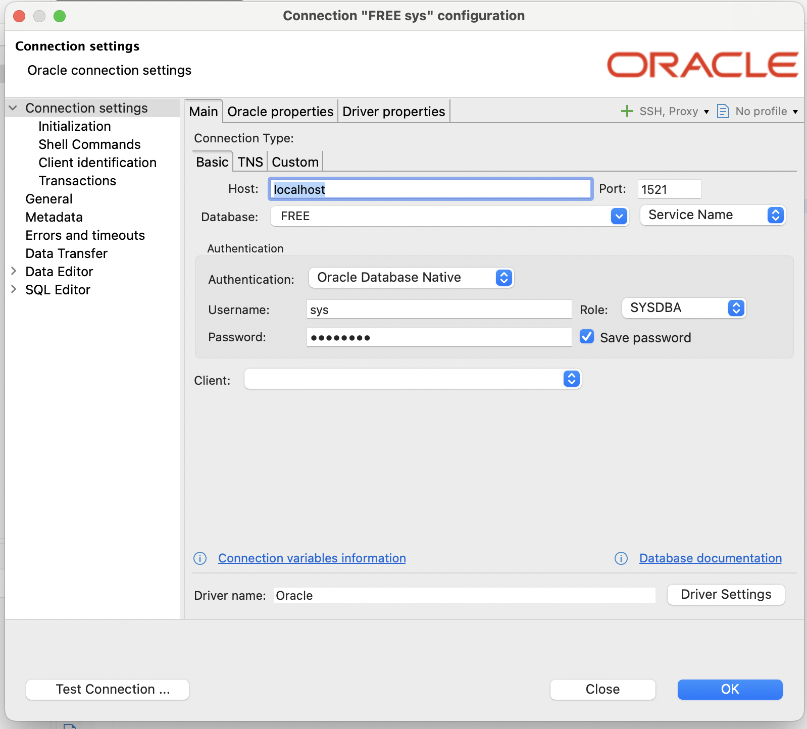
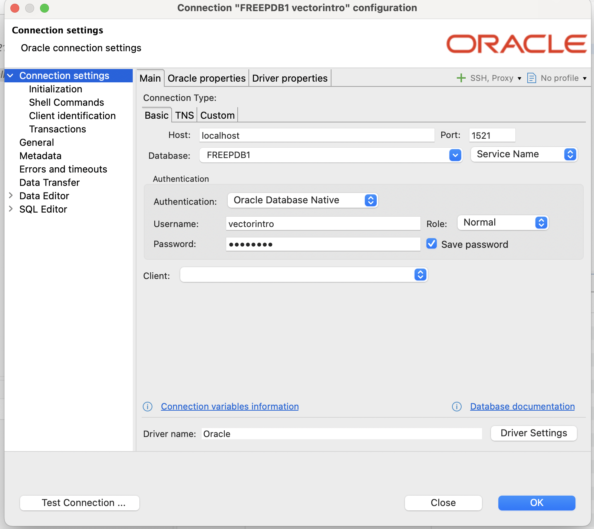

My original plan was to create this note before taking the [Oracle AI Vector Search Professional](https://education.oracle.com/oracle-ai-vector-search-professional/pexam_1Z0-184-25) exam. But it has been months since I took the exam. Now the purpose of this note is to serve as a cheat sheet when I may need it again in the future.

## Install Oracle Database 23ai

Oracle provides multiple ways to [install Oracle Database 23ai](https://www.oracle.com/database/free/get-started/) for free. I chose to use the container image since I work with multiple operating systems, and I think the container is the most portable across operating systems (kinda funny, knowing the container is linux-specific feature). 

If you choose to do the same, you can use my already built `docker-compose.yaml` file for running Oracle Database 23ai. First, you will need to clone my Docker Compose collection repository.

```bash
git clone https://github.com/rochimfn/compose-collection.git
```

Create a new docker network to allow another docker compose container to connect to each other.
```bash
docker network create database
```

Enter the oracle directory.
```bash
cd compose-collection/oracle
```

Start the container.
```bash
docker compose up -d
```

To stop the container, run the below command.
```bash
cd compose-collection/oracle
docker compose down
```

To reset the container's volume (REMOVE ALL DATA), add -v when stopping the container.
```bash
docker compose down -v
```

## Access the Database

Oracle includes the `sqlplus` client in the container image. Run the below command to use it to access the database .

```bash
docker exec -it oracle-db-1 sqlplus sys/password@FREE as sysdba
```
>If you don't use docker, you may need to adjust the name or the flag to access the client. For additional reference, you may read Connecting from Within the Container section on [this page](https://container-registry.oracle.com/ords/ocr/ba/database/free). 

Personally, I liked to use [DBeaver](https://dbeaver.io/) because it makes fixing queries very easy. Here is the connection configuration.

- Host      : localhost
- Port      : 1521
- Database  : FREE
- Username  : sys
- Role      : SYSDBA
- Password  : password



## Creating Dedicated User

I liked to create a dedicated user inside FREEPDB1 instead of directly using the root CDB. Here is an example sql statement to create a new *vectorintro* user inside FREEPDB1 with the password *password*.

```sql
alter session set container=FREEPDB1;

create user vectorintro identified by password;
grant connect, resource to vectorintro;
grant unlimited tablespace to vectorintro; 
```

Next, you can create a new connection with the below configuration.

- Host      : localhost
- Port      : 1521
- Database  : FREEPDB1
- Username  : sys
- Role      : SYSDBA
- Password  : password



## DDL Operation

Connect as the *vectorintro* user and let's try a DDL operation involving the vector data type.

### Create table

The datatype name for vector is VECTOR. To create a table containing the vector datatype, you can state VECTOR as the datatype, and it will work just fine.
```sql
CREATE TABLE first_table (id NUMBER, document VARCHAR(255), embedding VECTOR);
```

VECTOR accepts three parameters. The first one is the number of dimensions. The second is the format of the dimensions. And, the third is how to store the vector. To find the possible values for each parameter, you can read [this documentation](https://docs.oracle.com/en/database/oracle/oracle-database/23/vecse/create-tables-using-vector-data-type.html). By default (without stating any parameter), it will accept an arbitrary number of dimensions and formats, also it will store it in DENSE mode.

### Add vector to existing table

Create table without vector datatype;
```sql
CREATE TABLE second_table (id NUMBER, document VARCHAR(255));
```

Now add a new vector column to the existing table.

```sql
ALTER TABLE second_table ADD embedding VECTOR; 
```

You can add another column if you want.

```sql
ALTER TABLE second_table ADD embedding2 VECTOR(200, FLOAT32,SPARSE); 
```

### Drop vector from existing table

Just as you expect.
```sql
ALTER TABLE second_table DROP COLUMN embedding2;
```

### Alter vector column on existing table

The usual syntax for column modification should look like this.
```sql
ALTER TABLE second_table MODIFY embedding VECTOR(200);
```

Unfortunately, it does not work, and I got error code [ORA-51859](https://docs.oracle.com/en/error-help/db/ora-51859/?r=23ai) that says "Unsupported VECTOR column modification. The VECTOR column is being modified to something other than VECTOR(\*,\*)". Which implied that I cannot alter vector column other than to VECTOR(\*,\*). At least in the version 23ai.

Let's try again, but now I will create the non-default vector column and then modify it to the default one.

```sql
ALTER TABLE second_table ADD embedding3 VECTOR(200,FLOAT32,SPARSE); 
ALTER TABLE second_table MODIFY embedding VECTOR(*,*);
```

And indeed, oracle database allows this operation.

### Indexing

Oracle Database 23ai supports two types of index: [Hierarchical Navigable Small World (HNSW)](https://docs.oracle.com/en/database/oracle/oracle-database/23/vecse/memory-neighbor-graph-vector-index.html) and [Inverted File Flat (IVF)](https://docs.oracle.com/en/database/oracle/oracle-database/23/vecse/neighbor-partition-vector-index.html). What to choose between those two? Unfortunately, just like any other index types, they are very tied to your specific workflow. As a starting point, you can read about indexing [sections](https://docs.oracle.com/en/database/oracle/oracle-database/23/vecse/create-vector-indexes-and-hybrid-vector-indexes.html) of documentation.


#### Create HNSW Index

Here is the simplest [syntax to create HNSW index](https://docs.oracle.com/en/database/oracle/oracle-database/23/vecse/hierarchical-navigable-small-world-index-syntax-and-parameters.html).
```sql
ALTER TABLE second_table ADD embedding4 VECTOR;
CREATE VECTOR INDEX example_hnsw_idx ON second_table (embedding4) ORGANIZATION INMEMORY GRAPH;
```

You will get an error [ORA-51962](https://docs.oracle.com/en/error-help/db/ora-51962/?r=23ai) that says "The vector memory area is out of space for the current container". This error is expected. By default, there is no memory allocated for Vector Pool.

To allocate memory for Vector Pool, execute the following command as *sys* user with sqltool cli client.

```sql
alter system set vector_memory_size=1G scope=spfile;
```

> For some reason, using SCOPE=BOTH as stated in [the documentation](https://docs.oracle.com/en/database/oracle/oracle-database/23/vecse/size-vector-pool.html) won't work. Thanks to the  [https://enesi.no/2024/05/oracle-database-23ai-and-vector-search/](https://enesi.no/2024/05/oracle-database-23ai-and-vector-search/) for a success example of changing vector_memory_size.

Restart the container and try again the create index statement above. It should be working now. Read more about creating vector index syntax [here](https://docs.oracle.com/en/database/oracle/oracle-database/23/sqlrf/create-vector-index.html).


#### Create IVF Index

Syntax for creating IVF index is very close to HNSW.

Example 
```sql
ALTER TABLE second_table ADD embedding5 VECTOR;
CREATE VECTOR INDEX example_ivf_idx ON second_table (embedding5)  ORGANIZATION NEIGHBOR PARTITIONS;
```

For complete reference, please read this [sql reference](https://docs.oracle.com/en/database/oracle/oracle-database/23/sqlrf/create-vector-index.html).

## DML Operation

Connect as *vectorintro* user to FREEPDB1. Create our primary table.
```sql
CREATE TABLE example_tbl (id NUMBER, document VARCHAR(255), embedding VECTOR(5,int8));
```

### Insert

Write vector like creating list in Python. Wrap the item in the square bracket and separate the item with a comma. Then wrap again with quotes (like varchar). For example: '[1,2,3,4,5]', '[1.1,1.2,1.3,1.4,1.5]'. Then insert it like inserting into a varchar column.

```sql
INSERT INTO example_tbl (id, document, embedding) VALUES (1,'This is first example', '[1,2,3,4,5]');
```

### Update

Make sure the vector syntax is correct and you can update vector values just like any other data type.

```sql
INSERT INTO example_tbl (id, document, embedding) VALUES (2,'This is second example', '[2,3,4,5,6]');
UPDATE example_tbl SET embedding='[3,4,5,6,7]' WHERE id=2;
```

### Delete

Delete by id is working just fine.

```sql
INSERT INTO example_tbl (id, document, embedding) VALUES (3,'This is third example', '[5,6,7,8,9]');
DELETE FROM example_tbl WHERE id=3;
```

### Select 

Select also works normally.

```sql
SELECT * FROM example_tbl;
SELECT * FROM example_tbl WHERE id=1;
```

### Vector Distance for Similarity Search

The main operation for vector data type is to compute distance. Ideally, the more data similar to each other, the more similar (close) to the vector for the data. So by computing the distance between the vector inside the table and the vector generated from our query, we can discover or retrieve the most similar data.

Oracle Database 23ai provides multiple vector distance metrics. The difference between metrics can be read [here](https://docs.oracle.com/en/database/oracle/oracle-database/23/vecse/vector-distance-metrics.html). For this part, we'll use the cosine similarity because it is the default metric used when creating an index.

### Exact Similarity Search
Exact similarity search is the most basic similarity search on Oracle Database 23ai. It will scan the entire table and look for the rows with the closest vector distances.

Create a new example table.
```sql
CREATE TABLE example_tbl2 (id NUMBER, document VARCHAR(255), embedding VECTOR(5,int8));
```

Seed with dummy data.
```sql
INSERT INTO example_tbl2 (id, document, embedding) VALUES 
(1,'This is first example', '[1,2,3,4,5]'),
(2,'This is second example', '[2,3,4,5,6]'),
(3,'This is third example', '[3,4,5,6,7]'),
(4,'This is fourth example', '[4,5,6,7,8]'),
(5,'This is fifth example', '[5,6,7,8,9]');
```

Now let's do exact similarity search. Generally, the vectors should be generated by some machine learning model. But just for example, we'll just handcraft the vector.
```sql
SELECT * 
FROM example_tbl2 
ORDER BY VECTOR_DISTANCE( embedding, TO_VECTOR('[0,1,2,3,4]',5,int8), COSINE ) 
FETCH EXACT FIRST 3 ROWS ONLY;
```

It should return documents with ids 1,2, and 3.
```md
ID|DOCUMENT              |EMBEDDING  |
--+----------------------+-----------+
 1|This is first example |[1,2,3,4,5]|
 2|This is second example|[2,3,4,5,6]|
 3|This is third example |[3,4,5,6,7]|
```

### Approximate Similarity Search
Compared to exact similarity search, approximate similarity search may not be as accurate. But approximate search does not need to scan the entire table. For performance and resources-sensitive workloads, it can be a better choice.

Vector index is a must when doing approximate similarity search. Let's create a new hnsw index on the example_tbl2 table.

```sql
CREATE VECTOR INDEX embedding_hnsw_idx ON example_tbl2 (embedding)  ORGANIZATION INMEMORY GRAPH;
```

The syntax for approximate similarity search is close to the exact similarity search. Just change the EXACT keyword into APPROXIMATE.
```sql
SELECT *
FROM example_tbl2
ORDER BY VECTOR_DISTANCE( embedding, TO_VECTOR('[0,1,2,3,4]',5,int8), COSINE)
FETCH APPROXIMATE FIRST 3 ROWS ONLY;
```

To confirm that the index is being utilised, do EXPLAIN PLAN.
```sql
EXPLAIN PLAN FOR
SELECT *
FROM example_tbl2
ORDER BY VECTOR_DISTANCE( embedding, TO_VECTOR('[0,1,2,3,4]',5,int8), COSINE)
FETCH APPROXIMATE FIRST 3 ROWS ONLY;
```

View the plan.
```sql
SELECT * FROM TABLE(DBMS_XPLAN.DISPLAY);
```

The result should look like this.
```
PLAN_TABLE_OUTPUT                                                                                    |
-----------------------------------------------------------------------------------------------------+
Plan hash value: 2564862259                                                                          |
                                                                                                     |
-----------------------------------------------------------------------------------------------------|
| Id  | Operation                      | Name               | Rows  | Bytes | Cost (%CPU)| Time     ||
-----------------------------------------------------------------------------------------------------|
|   0 | SELECT STATEMENT               |                    |     3 | 12732 |     2  (50)| 00:00:01 ||
|*  1 |  COUNT STOPKEY                 |                    |       |       |            |          ||
|   2 |   VIEW                         |                    |     5 | 21220 |     2  (50)| 00:00:01 ||
|*  3 |    SORT ORDER BY STOPKEY       |                    |     5 | 21220 |     2  (50)| 00:00:01 ||
|   4 |     TABLE ACCESS BY INDEX ROWID| EXAMPLE_TBL2       |     5 | 21220 |     1   (0)| 00:00:01 ||
|   5 |      VECTOR INDEX HNSW SCAN    | EMBEDDING_HNSW_IDX |     5 | 21220 |     1   (0)| 00:00:01 ||
-----------------------------------------------------------------------------------------------------|
                                                                                                     |
Predicate Information (identified by operation id):                                                  |
---------------------------------------------------                                                  |
                                                                                                     |
   1 - filter(ROWNUM<=3)                                                                             |
   3 - filter(ROWNUM<=3)                                                                             |
                                                                                                     |
Note                                                                                                 |
-----                                                                                                |
   - dynamic statistics used: dynamic sampling (level=2)                                             |
```

Do note that the approximate similarity search may fall back to exact similarity search if the index (or search query) is not correct. For example, change the distance metric to other than COSINE.
```sql
EXPLAIN PLAN FOR
SELECT /*+ VECTOR_INDEX_SCAN(example_tbl2 embedding_hnsw_idx) */ *
FROM example_tbl2
ORDER BY VECTOR_DISTANCE( embedding, TO_VECTOR('[0,1,2,3,4]',5,int8), EUCLIDEAN)
FETCH APPROXIMATE FIRST 3 ROWS ONLY;
```

View the plan.
```sql
SELECT * FROM TABLE(DBMS_XPLAN.DISPLAY);
```

The result should look like this.
```
PLAN_TABLE_OUTPUT                                                                       |
----------------------------------------------------------------------------------------+
Plan hash value: 3107051639                                                             |
                                                                                        |
----------------------------------------------------------------------------------------|
| Id  | Operation               | Name         | Rows  | Bytes | Cost (%CPU)| Time     ||
----------------------------------------------------------------------------------------|
|   0 | SELECT STATEMENT        |              |     3 | 12732 |     4  (25)| 00:00:01 ||
|*  1 |  COUNT STOPKEY          |              |       |       |            |          ||
|   2 |   VIEW                  |              |     5 | 21220 |     4  (25)| 00:00:01 ||
|*  3 |    SORT ORDER BY STOPKEY|              |     5 | 21220 |     4  (25)| 00:00:01 ||
|   4 |     TABLE ACCESS FULL   | EXAMPLE_TBL2 |     5 | 21220 |     3   (0)| 00:00:01 ||
----------------------------------------------------------------------------------------|
                                                                                        |
Predicate Information (identified by operation id):                                     |
---------------------------------------------------                                     |
                                                                                        |
   1 - filter(ROWNUM<=3)                                                                |
   3 - filter(ROWNUM<=3)                                                                |
                                                                                        |
Hint Report (identified by operation id / Query Block Name / Object Alias):             |
Total hints for statement: 1 (U - Unused (1))                                           |
---------------------------------------------------------------------------             |
                                                                                        |
   4 -  SEL$1 / "EXAMPLE_TBL2"@"SEL$1"                                                  |
         U -  VECTOR_INDEX_SCAN(example_tbl2 embedding_hnsw_idx)                        |
                                                                                        |
Note                                                                                    |
-----                                                                                   |
   - dynamic statistics used: dynamic sampling (level=2)                                |
```

The Oracle Database 23ai fallback to exact similarity search (TABLE ACCESS FULL) and ignores the APPROXIMATE keyword and index hint.

Anyway, that is it from me. Thank you for reading, and see you in the next post.